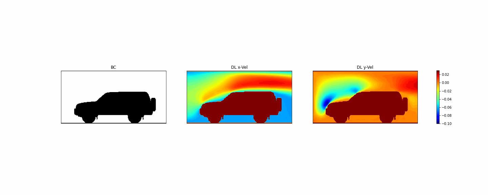

# CFD-DeepLearning-UNET
This is a research code (not a production level software) inspired by: O Hennigh, Automated design using neural networks and gradient descent, 2018, arXiv preprint arXiv:1710.10352

Implementation using Keras x, TensorFlow 2.2.4, Python 3.x and Juypter Notebook.

## Presentation
Solving Complex Engineering Problems with CFD and DL in /report 

## U-Net Architecture (Prediction Network)

## Training Data 

## Test Data: Predictions

## Validation Data: Predictions

## Validation Data: Predictions

